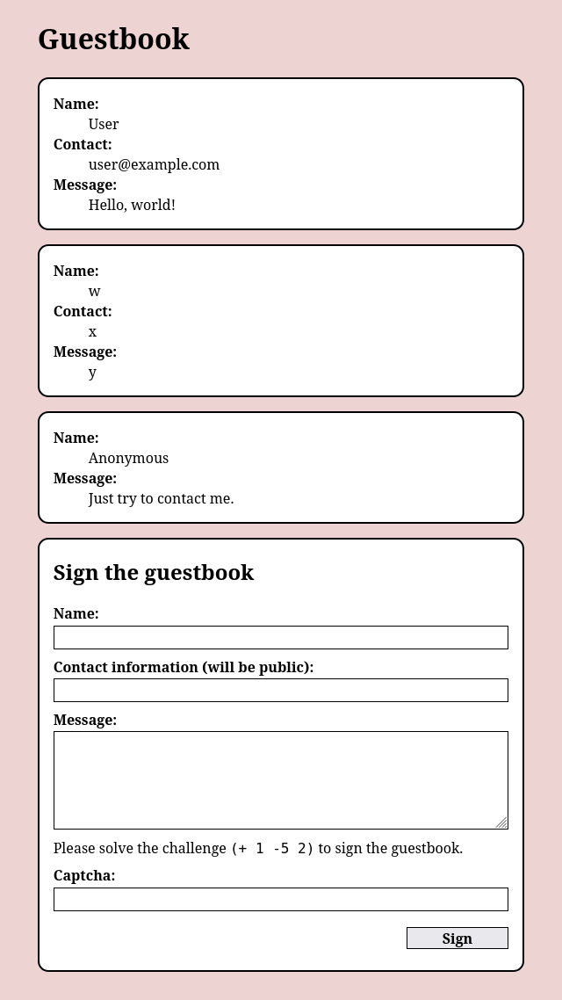

# Joker CGI Guestbook

This is a toy old-school
[CGI](https://en.wikipedia.org/wiki/Common_Gateway_Interface) guestbook
implemented in [Joker](https://joker-lang.org/), a dialect of Clojure.
The shebang line reflects that I wrote it
for use on the [SDF Public Access UNIX System](https://sdf.org).

## Description

The guestbook is a self-contained CGI script with no dependencies
except Joker 1.4.0 or later.
Like old CGI scripts, it has editable configuration at the top.
Data is stored in a [Bolt](https://github.com/etcd-io/bbolt) database,
which Joker has built in.
Captchas are stateless and use [HMAC](https://en.wikipedia.org/wiki/HMAC)
to verify the solved challenge is authentic and recent.
The secret key for HMAC is generated automatically and stored in the database.
This is a reason to forbid public access to it.

There is no management interface.
Use [boltbrowser](https://github.com/br0xen/boltbrowser)
to browse and edit the database.
To hide an entry without deleting it:

1. Find the entry in the Bolt bucket `entries`.
2. Edit the JSON object to add a key `hide` with the value `true`.

This project is a toy.
I don't know how actively I am going to maintain it.
Expect less testing, feature development, and support
than from a regular project.

## Screenshot

## Setup

You will need an HTTP server with CGI enabled, like
[Apache](https://httpd.apache.org/docs/2.4/howto/cgi.html)
or
[Caddy](https://github.com/aksdb/caddy-cgi).

1. Download or build a Joker binary.
   Binaries for Free/Net/OpenBSD, Linux, Mac, and Windows
   are attached to Joker
   [releases](https://github.com/candid82/joker/releases).
   Install the binary on your server.
   On a public Unix system like SDF,
   you may be able to install the binary in your home directory
   and use it for CGI.

2. Download the source code file of the guestbook, `guestbook.joke`.
   You can and should clone the repository to track your customizations in Git.
   Edit the file.
   Update the
   [shebang line](https://en.wikipedia.org/wiki/Shebang_%28Unix%29)
   to the absolute path to your Joker interpreter.
   Update the settings as desired.

3. Create a directory like `/guestbook/` in your server's CGI root.
   Copy your customized `guestbook.joke` to the directory
   with a filename the server will recognize
   as a directory-index CGI script, like `index.cgi`.

4. Access the guestbook on your server
   (for example, <http://localhost/guestbook/>)
   and confirm that it works.

5. Make sure web clients cannot access the database file
   (for example, <http://localhost/guestbook/guestbook.bolt>
   with the default filename `guestbook.bolt`).

## License

MIT.
See the file [`LICENSE`](LICENSE).
